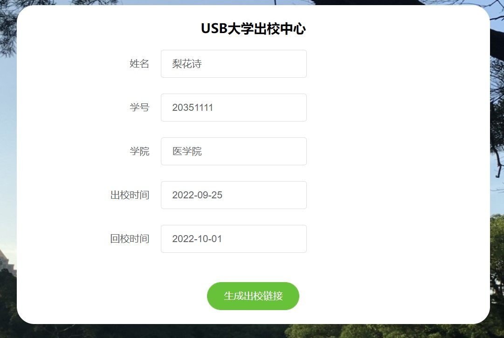
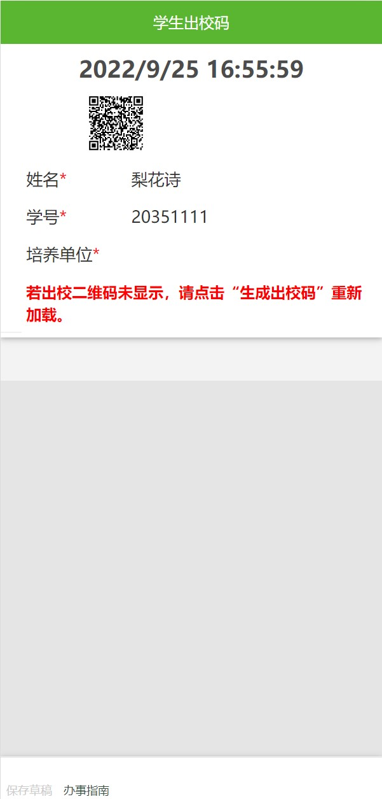
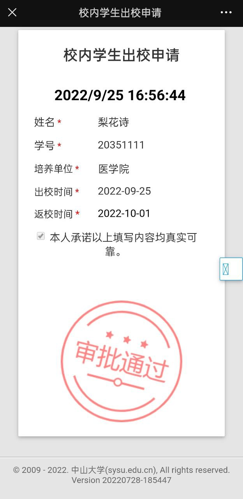

# USB
USB-中山大学小学出校中心

- 三个网页app分别在三个文件夹当中，可以自行部署
- 或者直接白嫖（正确的）

# 更新   
- 2022.10.03更新
取消裸IP访问，防止微信出现“继续访问按钮”，扫码更丝滑

# 白嫖步骤：
1.访问部署好的USB中心 https://usb.sub.vg     
2.胡乱填写信息
   
3.点击【生成出校链接】按钮转到审核通过页面（慢慢等，小水管，建议用流量打开）    
     
4.扫码（给保安扫的）看看保安视角     
     
5.愣着干什么，出校啊

# 部署步骤：
具体某些代码（甚至html）里面有中文显示【绿色页面服务器】【二维码服务器】先自行修改为你的服务器的IP

```
git clone https://github.com/sysuyyds/NoMoreUSC
```
两个文件夹（除了USB）app扔两台服务器上面（或者一台上面多个端口你喜欢就好），USB直接cf免费部署或者vercel自己看着办
```
cd 某个文件夹
```
启动
```
python3 main.py
```
具体什么还有pip install qrcode
还有pip install pillow
没了不管了跑了
